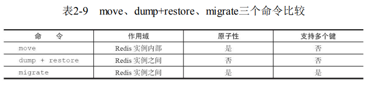
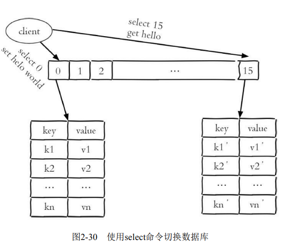

## 1、为什么单线程还能这么快

第一，纯内存访问，Redis 将所有数据放在内存中，内存的响应时长约为 100纳秒，这是 Redis 达到每秒万级别访问的重要基础。

第二，非阻塞 I/O，Redis 使用 epoll 作为 I/O 多路复用技术的实现，再加上 Redis自身的事件处理模型将 epoll 中的连接、读写、关闭都转换为事件，不在网络 I/O 上浪费过多时间

第三，单线程避免了线程切换和竟态产生的消耗

## 2、字符串

1、**string** 
set 命令
. ex seconds: 为键设置秒级过期时间。
. px milliseconds: 为键设置毫秒级过期时间。
. nx: 键必须不存在，才可以设置成功，用于添加。
. xx: 与 nx 相反，键必须存在，才可以设置成功，用于更新。

2、mset 批量设置值
127.0.0.1:6379> mset a 1 b 2 c 3

3、mget批量获取值
127.0.0.1:6379> mget a b c

4、incr 
incr 命令用于对值做自增，返回结果分为三种情况：
. 值不是整数，返回错误。
. 值上整数，返回自增后的结果。
. 键不存在，按照值为 0 自增，返回结果是 1。

5、**type** 命令返回当前键的数据结构类型
127.0.0.1:6379> type a
127.0.0.1:6379> string

6、**objec encoding** 查询内部编码
127.0.0.1:6379>object encoding hello
127.0.0.1:6379> "embstr"

7、内部编码
1、字符串的内部编码有 3 种：
. int: 8 个字节的长整型。
. embstr: 小于等于 39 个字节的字符串。
. raw: 大于 39 个字节的字符串。

## 4、哈希
### 1、命令
(1) 设置值
hset key field value
127.0.0.1:6379> hset user:1 name tome
127.0.0.1:6379> hset user:1 age 18

(2) 获取值
hget key field
127.0.0.1:6379> hget user:1 name

(3) 删除 field
127.0.0.1:6379> hdel user:1 name
127.0.0.1:6379> hdel user:1 age

(4) 计算 field 个数
hlen key
127.0.0.1:6379> hlen user:1

(5) 批量设置或获取 field-value
hmget key field [field ...]
hmset key field value [field value ...]
127.0.0.1:6379> hmset user:1 name mike age 12 city guangzhou
127.0.0.1:6379> hmget user:1 name age city

(6) 判断 field 是否存在
hexists key field
127.0.0.1:6379> hexists user:1 name

(7) 获取所有 field
hkeys key
127.0.0.1:6379> hkeys user:1
1) "name"
2) "age"
3) "city"

(8) 获取所有 value
hvals key
127.0.0.1:6379> hvals user:1
1) "mike"
2) "12"
3) "gz"

(9) 获取所有的 field-value
hgetall key
127.0.0.1:6379> hgetall user:1
1) "name"
2) "mike"
3) "age"
4) "12"
5) "city"
6) "gz"

(10) hincrby hincrbyfloat
(11) 计算 value 的字符串长度
hstrlen key field
127.0.0.1:6379> hstrlen user:1 name
(integer) 4

### 2、编码
（1）ziplist（压缩列表）：当哈希类型元素个数小于 hash-max-ziplist-entries 配置（默认 512 个）、同时所有值都小于 hash-max-ziplist-value 配置（默认 64 字节）时，Redis 会使用 ziplist 作为哈希的内部实现，ziplist 使用更加紧凑的结构实现多个元素的连续存储，所以在节省内存方面比 hashtable 更加优秀。
（2）hashtable（哈希表）：当哈希类型无法满足 ziplist 的条件时，Redis 会使用 hashtable 作为哈希的内部实现，因此此时 ziplist 的读写效率会下降，而 hashtable 的读写时间复杂度为 O(1)


## 6、列表
列表的四种操作类型
添加：rpush、lpush、linsert
查：lrange、lindex、llen
删除：lpop、rpop、lrem、ltrim
修改：lset
阻塞操作：blpop、brpop

### 1、编码
（1）ziplist（压缩列表）：当列表元素个数小于 list-max-ziplist-entries 配置（默认 512 个）、同时列表中每个元素都小于 list-max-ziplist-value 配置（默认 64 字节）时，Redis 会使用 ziplist 作为列表的内部实现来减少内存的使用。
（2）linkedlist（链表）：当列表类型无法满足 ziplist 的条件时，Redis 会使用 linkedlist 作为列表的内部实现

### 2、口诀
. lpush + lpop = Stack（栈）
. lpush + rpop = Queue（队列）
. lpush + ltrim = Capped Collection（有限集合）
. lpush + brpop = Message Queue（消息队列）

## 7、集合
### 1、命令
（1）添加元素
sadd key element [element ...]
127.0.0.1:6379> exists myset
(integer) 0
127.0.0.1:6379> sadd myset a b c
(integer) 3
127.0.0.1:6379> sadd myset a b
(integer) 0]

（2）删除元素
srem key element [element ...]
127.0.0.1:6379> srem myset a b
(integer) 2
127.0.0.1:6379> srem myset hello
(integer) 0

（3）计算元素个数
127.0.0.1:6379> scard myset
(integer) 1

（4）判断元素是否在集合中
127.0.0.1:6379> sismember myset c
(integer) 1

（5）随机从集合返回指定个数元素
srandmember key [count]
127.0.0.1:6379> srandmember myset
"c"
127.0.0.1:6379> srandmember myset 3
1) "c"
2) "a"
3) "e"

（6）从集合随机弹出元素
127.0.0.1:6379> spop myset 
"e"
127.0.0.1:6379> spop myset 3
1) "c"
2) "b"
3) "a"

（7）获取所有元素
smembers key
127.0.0.1:6379> smembers myset
1) "d"
2) "b"
3) "g"
4) "c"
5) "a"
6) "f"
7) "e"

### 2、集合间的操作
（1）求多个集合的交集
sinter key [kye ...]
127.0.0.1:6379> sadd user:2:follow it news ent sports
(integer) 4
127.0.0.1:6379> sadd user:1:follow it music his sports
(integer) 4
127.0.0.1:6379> sinter user:1:follow user:2:follow
1) "sports"
2) "it"

（2）求多个机会的并集
sunion key [key ...]
127.0.0.1:6379> sunion user:1:follow user:2:follow
1) "ent"
2) "his"
3) "music"
4) "sports"
5) "news"
6) "it"

（3）求多个集合的差集
sdiff key [key ...]
127.0.0.1:6379> sdiff user:1:follow user:2:follow
1) "his"
2) "music"

（4）将交集、并集、差集的结果保存
sinterstore destination key [key ...]
sunionstore destination key [key ...]
sdiffstore destination key [key ...]

127.0.0.1:6379> sinterstore user:1_2:inter user:1:follow user:2:follow
(integer) 2
127.0.0.1:6379> type user:1_2:inter
set
127.0.0.1:6379> smembers user:1_2:inter
1) "sports"
2) "it"

### 3、内部编码
集合类型的内部编码有两种
. intset（整数集合）：当集合的元素都是整数且元素个数小于 set-max-intset-entries 配置（默认 512 个）时，Redis 会选用 intset 来作为集合的内部实现，从而减少内存使用。
. hashtable（哈希表）：当集合类型无法满足 intset 的条件时，Redis 会使用 hashtable 作为集合的内部实现

### 4、使用场景
标签

## 8、有序集合
### 1、命令
（1）添加成员
zadd key score member [score member ...]
127.0.0.1:6379> zadd user:ranking 250 tome
(integer) 1
127.0.0.1:6379> zadd user:ranking 1 kris 91 mike 200 frank 339 tim 333 martin
(integer) 5

（2）计算成员个数
zcard key
127.0.0.1:6379> zcard user:ranking
(integer) 6

（3）计算某个成员的分数
zscore key member
127.0.0.1:6379> zscore user:ranking martin
"333"
127.0.0.1:6379> zscore user:ranking test
(nil)

（4）计算成员排名
zrank key member
zrevrank key member
排名是从第 0 开始
127.0.0.1:6379> zrank user:ranking tim
(integer) 4
127.0.0.1:6379> zrank user:ranking kris
(integer) 0

（5）删除成员
zrem key member [member ...]
127.0.0.1:6379> zrem user:ranking tim
(integer) 1

（6）增加成员分数
zincrby key increment member
127.0.0.1:6379> zincrby user:ranking 10 mike
"101"

（7）返回指定排名范围的成员
zrange 	   key start end [withscores]
zrevrange key start end [withscores]
127.0.0.1:6379> zrange user:ranking 0 2 withscores
1) "kris"
2) "1"
3) "mike"
4) "101"
5) "frank"
6) "200"

127.0.0.1:6379> zrevrange user:ranking 0 2 withscores
1) "martin"
2) "333"
3) "tome"
4) "250"
5) "frank"
6) "200"

（8）返回指定分数范围的成员
zrangebyscore 	 key min max [withscores] [limit offset count]
zrevrangebyscore key max min [withscores] [limit offset count]
127.0.0.1:6379> zrangebyscore user:ranking 0 200 withscores
1) "kris"
2) "1"
3) "mike"
4) "101"
5) "frank"
6) "200"
127.0.0.1:6379> zrevrangebyscore user:ranking 200 0 withscores
1) "frank"
2) "200"
3) "mike"
4) "101"
5) "kris"
6) "1"

同时 min 和 max 还支持开区间（小括号）和闭区间（中括号），-inf 和 +inf 分别代表无限小和无限大：
127.0.0.1:6379> zrangebyscore user:ranking (200 +inf withscores
1) "tome"
2) "250"
3) "martin"
4) "333"
127.0.0.1:6379> zrevrangebyscore user:ranking +inf -inf withscores
 1) "martin"
 2) "333"
 3) "tome"
 4) "250"
 5) "frank"
 6) "200"
 7) "mike"
 8) "101"
 9) "kris"
10) "1"

（9）返回指定分数范围成员个数
zcount key min max
127.0.0.1:6379> zcount user:ranking 100 221
(integer) 2


## 键管理
针对单个键的命令
type、del、object、exists、expire
### 1、键重命名
**rename** key newKey
127.0.0.1:6379> set python jedis
OK
127.0.0.1:6379> get python
"jedis"
127.0.0.1:6379> rename python java
OK
127.0.0.1:6379> get java
"jedis"
127.0.0.1:6379> get python
(nil)
如果在 rename 之前， 键 java 已经存在，那么它的值也将被覆盖。

**renamenx** 命令，确保只有 newKey 不存在时才被覆盖。
127.0.0.1:6379> set java jedis
OK
127.0.0.1:6379> set python redis-py
OK
127.0.0.1:6379> renamenx java python
(integer) 0
127.0.0.1:6379> get java
"jedis"
127.0.0.1:6379> get python
"redis-py"

### 2、随机返回一个键
randomkey
127.0.0.1:6379> dbsize
(integer) 25
127.0.0.1:6379> randomkey
"user:2:follow"
127.0.0.1:6379> randomkey
"listkey"
127.0.0.1:6379> randomkey
"1101000060"

### 3、键过期
. expire key second: 键在 seconds 秒后过期
. expireat key timestamp: 键在秒级时间戳 timestamp 后过期

127.0.0.1:6379> set hello world
OK
127.0.0.1:6379> expire hello 10
(integer) 1
127.0.0.1:6379> ttl hello
(integer) 6
127.0.0.1:6379> ttl hello
(integer) -2
. 大于等于0 的整数：键剩余的过期时间（ ttl 是秒，pttl 是毫秒）
. -1：键没有设置过期时间。
. -2：键不存在

127.0.0.1:6379> expireat hello 1637225927
(integer) 1

. pexpire key milliseconds：键在 milliseconds 毫秒后过期
. pexpireat key milliseconds-timestamp 键在毫秒级时间戳 timestamp 后过期

注意：在使用 Redis 相关过期命令时，需要注意以下几点
1）如果 expire key 的键不存在，返回结果为 0：
127.0.0.1:6379> expire not_exits_key 30
(integer) 0

2）如果过期时间为负值，键会立即被删除，犹如使用 del 命令一样：
127.0.0.1:6379> set hello world 
OK
127.0.0.1:6379> expire hello -2
(integer) 1
127.0.0.1:6379> get hello
(nil)

3）persist命令可以将键的过期时间清除：
127.0.0.1:6379> hset hkey f1 v1
(integer) 1
127.0.0.1:6379> expire hkey 50
(integer) 1
127.0.0.1:6379> ttl hkey
(integer) 45
127.0.0.1:6379> persist hkey
(integer) 1
127.0.0.1:6379> ttl hkey
(integer) -1

4）对于字符串类型键，执行 set 命令去掉过期时间。
127.0.0.1:6379> expire hello 50
(integer) 1
127.0.0.1:6379> ttl hello
(integer) 46
127.0.0.1:6379> set hello world
OK
127.0.0.1:6379> ttl hello
(integer) -1

5）Redis 不支持二级数据结构（例如哈希、列表）内部元素的过期功能，例如不能对列表类型的一个元素做过期时间设置

6）setex 命令作为 set+expire 的组合，不但上原子执行，同时减少了一次网络通信时间。

### 4、迁移键
**move**、**dump+restore**、**migrate** 


## 遍历键 

### 1.全量遍历
```
keys pattern
```

* \* 代表匹配任意字符。
* ? 代表匹配一个字符。
* [] 代表匹配部分字符，例如 [1,3] 代表匹配 1,3 ，[1-10] 代表匹配 1 到 10点任意数字 。
* \x用来做转义，例如要匹配星号、问号要需要转义。

### 2.渐进式遍历

```
scan cursor [match pattern] [count number]
```

* cursor 是必须参数，实际上 cursor 是一个游标，第一次遍历从 0 开始，每次 scan遍历完都会返回当前游标的值，直到游标值为 0， 表示遍历结束。

* match pattern是可选参数，它的作用的是做模式的匹配，这点和keys的 模式匹配很像。
* count number是可选参数，它的作用是表明每次要遍历的键个数，默认 值是10，此参数可以适当增大。

127.0.0.1:6380> scan 0
1) "22"
2)  1) "p"
    2) "f"
    3) "q"
    4) "n"
    5) "x"
    6) "j"
    7) "w"
    8) "s"
    9) "u"
   10) "c"

127.0.0.1:6380> scan 22
1) "19"
2)  1) "h"
    2) "z"
    3) "i"
    4) "o"
    5) "g"
    6) "r"
    7) "b"
    8) "d"
    9) "l"
   10) "e"
   11) "m"

127.0.0.1:6380> scan 19
1) "0"
2) 1) "v"
   2) "a"
   3) "t"
   4) "k"
   5) "y"

## 数据库管理
Redis提供了几个面向 Redis 数据库的操作，它们分别是 dbsize、select、flushdb/flushall 命令，

### 1.切换数据库
```
select dbIndex
```

Redis只是用数字作为多个数据库的实现。Redis默认配置中是有16个数据库

``` 
databases 16
```



### 2.flushdb/flushall

flushdb/flushall命令用于清除数据库，两者的区别的是flushdb只清除当 前数据库，flushall会清除所有数据库。

## 本章重点回顾

1）Redis提供5种数据结构，每种数据结构都有多种内部编码实现。

2）纯内存存储、IO多路复用技术、单线程架构是造就Redis高性能的三 个因素。

3）由于Redis的单线程架构，所以需要每个命令能被快速执行完，否则 会存在阻塞Redis的可能，理解Redis单线程命令处理机制是开发和运维Redis 的核心之一。 

4）批量操作（例如mget、mset、hmset等）能够有效提高命令执行的效 率，但要注意每次批量操作的个数和字节数。 

5）了解每个命令的时间复杂度在开发中至关重要，例如在使用keys、 hgetall、smembers、zrange等时间复杂度较高的命令时，需要考虑数据规模 对于Redis的影响。 

6）persist命令可以删除任意类型键的过期时间，但是set命令也会删除 字符串类型键的过期时间，这在开发时容易被忽视。 

7）move、dump+restore、migrate是Redis发展过程中三种迁移键的方 式，其中move命令基本废弃，migrate命令用原子性的方式实现了 dump+restore，并且支持批量操作，是Redis Cluster实现水平扩容的重要工 具。 

8）scan命令可以解决keys命令可能带来的阻塞问题，同时Redis还提供了hscan、sscan、zscan渐进式地遍历hash、set、zset。