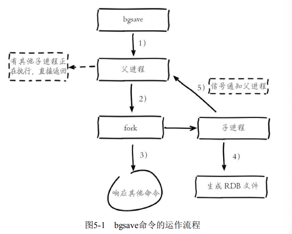
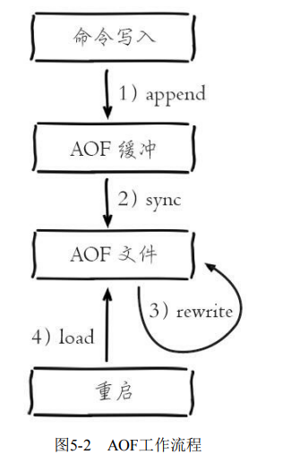
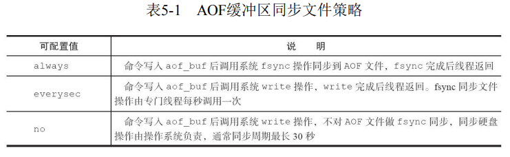
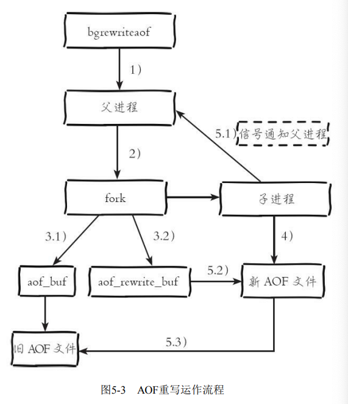
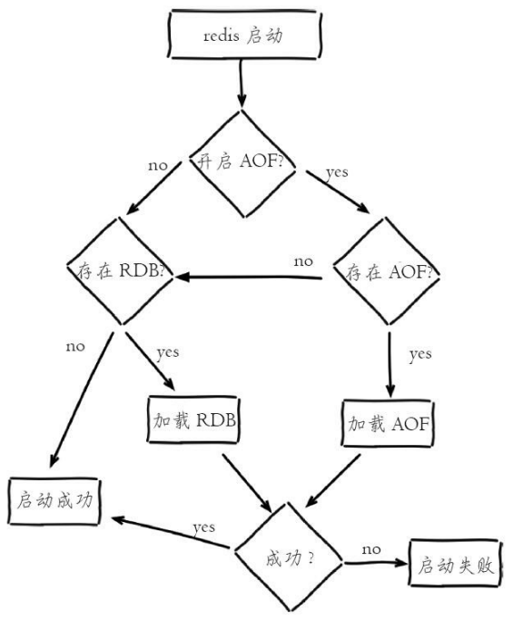
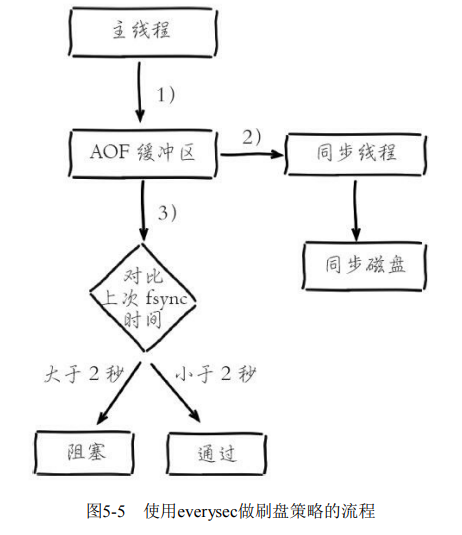

## <font color=cyan>5.1、RDB</font>

RDB持久化是把当前进程数据生成快照保存到硬盘的过程，触发RDB持 久化过程分为手动触发和自动触发。

### <font color=cyan>5.1.1、触发机制</font>
手动出发分别对应 save 和 bgsave

* svae命令：阻塞当前 Redis服务器，直到 RDB 过程完成为止，对于内存比较大的实例会造成长时间阻塞，线上环境不建议使用。
* bgsave命令：Redis 进程执行 fork 操作创建子进程，RDB 持久化过程由子进程负责，完成后自动结束。阻塞只发生在 fork 阶段，一般时间很短。

Redis 内部存在自动触发 RDB 的持久化机制

1）使用save相关配置，如“save m n”。表示m秒内数据集存在n次修改 时，自动触发bgsave。

2）如果从节点执行全量复制操作，主节点自动执行bgsave生成 RDB 文件并发送给从节点

3）执行debug reload命令重新加载Redis时，也会自动触发save操作。

4）默认情况下执行shutdown命令时，如果没有开启AOF持久化功能则 自动执行bgsave


### <font color=cyan>5.1.2、流程说明</font>



1）执行bgsave命令，Redis父进程判断当前是否存在正在执行的子进 程，如RDB/AOF子进程，如果存在bgsave命令直接返回。

2）父进程执行fork操作创建子进程，fork操作过程中父进程会阻塞，通 过info stats命令查看latest_fork_usec选项，可以获取最近一个fork操作的耗 时，单位为微秒。

3）父进程fork完成后，bgsave命令返回“Background saving started”信息 并不再阻塞父进程，可以继续响应其他命令。

4）子进程创建RDB文件，根据父进程内存生成临时快照文件，完成后 对原有文件进行原子替换。执行lastsave命令可以获取最后一次生成RDB的 时间，对应info统计的rdb_last_save_time选项。

5）进程发送信号给父进程表示完成，父进程更新统计信息，具体见 info Persistence下的rdb_*相关选项。

### <font color=cyan>5.1.3、RDB文件处理</font>
保存
压缩
校验

### <font color=cyan>5.1.4、RDB的优缺点</font>

**RDB 的优点：**

* RDB是一个紧凑压缩的二进制文件，代表Redis在某个时间点上的数据
快照。非常适用于备份，全量复制等场景。比如每6小时执行bgsave备份，
并把RDB文件拷贝到远程机器或者文件系统中（如hdfs），用于灾难恢复。
* Redis 加载 RDB 恢复数据远远快于 AOF

**RDB 的缺点**
* RDB方式数据没办法做到实时持久化/秒级持久化。因为bgsave每次运
行都要执行fork操作创建子进程，属于重量级操作，频繁执行成本过高。
* RDB文件使用特定二进制格式保存，Redis版本演进过程中有多个格式
的RDB版本，存在老版本Redis服务无法兼容新版RDB格式的问题。

## <font color=cyan>5.2、AOF (append only file)</font>

​	以独立日志的方式记录每次写命令，重启时再重新执行 AOF 文件中的命令达到恢复数据的目的。AOF 的主要作用是解决数据持久化的实时性。

### <font color=cyan>5.2.1、使用 AOF</font>

AOF 的工作流程操作：命令写入（append）、文件同步（sync）、文件重写（rewrite）、重启加载（load）



1）所有的写入命令会追加到aof_buf（缓冲区）中。

2）AOF缓冲区根据对应的策略向硬盘做同步操作。 

3）随着AOF文件越来越大，需要定期对AOF文件进行重写，达到压缩 的目的。

4）当Redis服务器重启时，可以加载AOF文件进行数据恢复。

了解AOF工作流程之后，下面针对每个步骤做详细介绍。

### <font color=cyan>5.2.2、命令写入</font>

AOF 命令写入的内容直接是文本协议格式。例如set hello world这条命 令，在AOF缓冲区会追加如下文本：

```
*3\r\n$3\r\nset\r\n$5\r\nhello\r\n$5\r\nworld\r\n
```

### <font color=cyan>5.2.3、文件同步</font>

Redis 提供了多种 AOF 缓冲区同步文件策略，由参数 appendfsync 控制。



系统调用 **write** 和 **fsync** 说明：

* **write**操作会触发延迟写（delayed write）机制。Linux在内核提供页缓冲区用来提高硬盘 IO 性能。write操作在写入系统缓冲区后直接返回。同步硬盘操作依赖于系统调度机制，例如：缓冲区页空间写满或达到特定时间周期。同步文件之前。如果此时系统故障宕机，缓冲区数据将丢失。

* **fsync** 针对单个文件操作（比如 AOF 文件），做强制硬盘同步，fsync将阻塞直到写入硬盘完成后返回，保证了数据持久化。

### <font color=cyan>5.2.4、重写机制</font>

随着命令不断写入 AOF， 文件会越来越大，为了解决这个问题，Redis 引入 AOF重写机制压缩文件体积。AOF 文件重写是把 Redis 进程内的数据转化为写命令同步到新 AOF文件的过程。

​		重写后的 AOF 文件为什么可以变小？
1）进程内已经超时的数据不再写入文件。
2）旧的AOF文件含有无效命令，如del key1、hdel key2、srem keys、set a111、set a222等。
3）多条写命令可以合并为一个，如：lpush list a、lpush list b、lpush list c可以转化为：lpush list a b c。

​		AOF 重写过程可以手动触发和自动触发：
* 手动触发：直接调用bgrewriteaof命令。 
* 自动触发：根据auto-aof-rewrite-min-size和auto-aof-rewrite-percentage参 数确定自动触发时机。

​		当触发AOF重写时，内部做了哪些事呢？下面结合图5-3介绍它的运行 流程。



流程说明：

1）执行 AOF 重写请求。
如果当前进程正在执行AOF重写，请求不执行并返回如下响应：

```
ERR Background append only file rewriting already in progress
```

如果当前进程正在执行bgsave操作，重写命令延迟到bgsave完成之后再 执行，返回如下响应：

```
Background append only file rewriting scheduled
```

2）父进程执行fork创建子进程，开销等同于bgsave过程。

3.1）主进程fork操作完成后，继续响应其他命令。所有修改命令依然写 入AOF缓冲区并根据appendfsync策略同步到硬盘，保证原有AOF机制正确 性。 

3.2）由于fork操作运用写时复制技术，子进程只能共享fork操作时的内 存数据。由于父进程依然响应命令，Redis使用“AOF重写缓冲区”保存这部 分新数据，防止新AOF文件生成期间丢失这部分数据。

4）子进程根据内存快照，按照命令合并规则写入到新的AOF文件。每 次批量写入硬盘数据量由配置aof-rewrite-incremental-fsync控制，默认为 32MB，防止单次刷盘数据过多造成硬盘阻塞。

5.1）新AOF文件写入完成后，子进程发送信号给父进程，父进程更新 统计信息，具体见info persistence下的aof_*相关统计。 

5.2）父进程把AOF重写缓冲区的数据写入到新的AOF文件。 

5.3）使用新AOF文件替换老文件，完成AOF重写。

### <font color=cyan>5.2.5、重启加载</font>

AOF和RDB文件都可以用于服务器重启时的数据恢复。如图5-4所示， 表示Redis持久化文件加载流程。



### <font color=cyan>5.2.6、文件校验</font>

## <font color=cyan>5.3、问题定位与优化</font>

Redis持久化功能一直是影响Redis性能的高发地，本节我们结合常见的 持久化问题进行分析定位和优化。

### <font color=cyan>5.3.1、fork操作</font>

fork() 耗时

如何改善fork操作的耗时： 

1）优先使用物理机或者高效支持fork操作的虚拟化技术，避免使用 Xen。 

2）控制Redis实例最大可用内存，fork耗时跟内存量成正比，线上建议 每个Redis实例内存控制在10GB以内。 

3）合理配置Linux内存分配策略，避免物理内存不足导致fork失败，具 体细节见12.1节“Linux配置优化”。 

4）降低fork操作的频率，如适度放宽AOF自动触发时机，避免不必要 的全量复制等。

### <font color=cyan>5.3.2、子进程开销监控和优化</font>

1、CPU 

2、内存

3、硬盘

### <font color=cyan>5.3.3、AOF追加阻塞</font>



1）主线程负责写入 AOF 缓冲区。

2）AOF 线程负责每秒执行一次同步磁盘操作，并记录最近一次同步时间。

3）主线程负责对比上次 AOF 同步时间：

* 如果上次同步成功时间在 2 秒内，主线程直接返回。
* 如果距上次同步成功时间超过 2 秒，主线程将会阻塞，直到同步操作完成。

通过对AOF阻塞流程可以发现两个问题：
1）everysec配置最多可能丢失2秒数据，不是1秒。 
2）如果系统fsync缓慢，将会导致Redis主线程阻塞影响效率。
