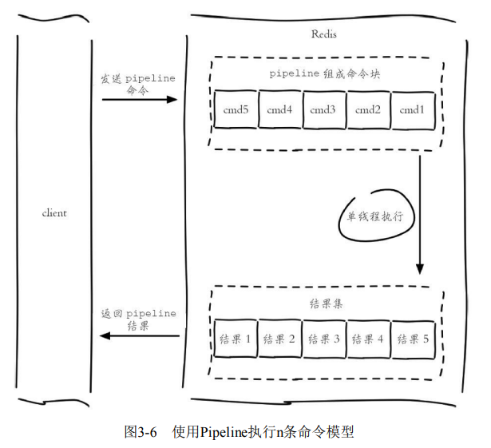
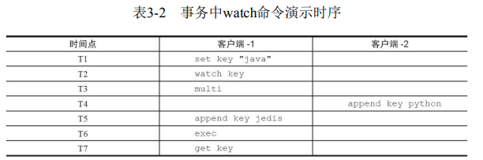
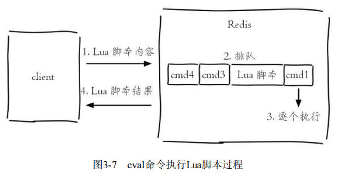
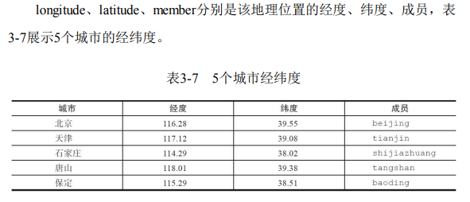
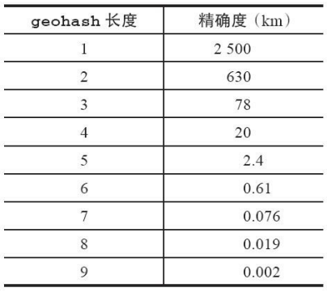

## 3.1 慢查询分析

对于慢查询功能，需要明确两件事： 
* 预设阀值怎么设置？
* 慢查询记录存放在哪？

## 3.2 Redis Shell

Redis提供了redis-cli、redis-server、redis-benchmark等Shell工具

### <font color=Cyan>3.2.1 redis-cli 详解</font>
#### 1、-r
#### 2、-i
#### 3、-x
#### 4、-c
#### 5、-a
#### 6、--scan --pattern
#### 7、--slave
#### 8、--rdb
#### 9、--pipe
#### 10、--bigkeys
#### 11、-eval
#### 12、-latency
	（1）--latency
	（2）--latency-history
	（3）--latency-dist
#### 13、--stat
#### 14、--raw和--no-raw

### <font color=Cyan>3.2.2 redis-server 详解</font>
redis-server- -test-memory可以用来检测当前操作系统能否稳定地分配指定容量的内存给 Redis，通过这种检测可以有效避免因为内存问题造成Redis崩溃
```
redis-server --test-memory 1024
```

### <font color=Cyan>3.2.3 redis-benchmark详解</font>
#### 1、-c
-c（clients）选项代表客户端的并发数量（默认是50）。
#### 2、-n<requests>
-n（num）选项代表客户端请求总量（默认是100000）。
#### 3、-q
-q选项仅仅显示redis-benchmark的requests per second信息。
#### 4、-r
在一个空的Redis上执行了redis-benchmark会发现只有3个键。
如果想向Redis插入更多的键，可以执行使用-r（random）选项，可以向
Redis插入更多随机的键。
```
$redis-benchmark -c 100 -n 20000 -r 10000
```
#### 5、-P
-P选项代表每个请求pipeline的数据量（默认为1）。
#### 6、-k<boolean>
-k选项代表客户端是否使用keepalive，1为使用，0为不使用，默认值为
1。

#### 7、-t
-t选项可以对指定命令进行基准测试
```
redis-benchmark  -t get,set -q 
SET: 80775.45 requests per second, p50=0.431 msec                   
GET: 84745.77 requests per second, p50=0.407 msec
```

#### 8、--csv
--csv选项会将结果按照csv格式输出，便于后续处理，如导出到Excel
等。
redis-benchmark  -t get,set --csv
"test","rps","avg_latency_ms","min_latency_ms","p50_latency_ms","p95_latency_ms","p99_latency_ms","max_latency_ms"
"SET","85324.23","0.408","0.216","0.407","0.567","0.591","1.607"
"GET","86505.19","0.400","0.208","0.399","0.559","0.583","1.983"

## <font color=Cyan>3.3 Pipeline</font>
### <font color=Cyan>3.3.1 Pipeline概念</font>
### <font color=Cyan>3.3.2 性能测试</font>



### <font color=Cyan>3.3.3 原生批量命令与 Pipeline 对比</font>

## <font color=Cyan>3.4 事务与 Lua</font>

### <font color=Cyan>3.4.1、事务</font>

multi 命令代表开始事务

exec 命令代表事务结束

discard 命令停止事物执行

如果事务中的命令出现错误，Redis的处理机制也不尽相同。

1、命令错误

2、运行时错误

3、watch 实现乐观锁


#T1：客户端1
127.0.0.1:6379> set key "java"
OK
#T2：客户端1
127.0.0.1:6379> watch key
OK
#T3：客户端1
127.0.0.1:6379> multi
OK
#T4：客户端2
127.0.0.1:6379> append key python
(integer) 11
#T5：客户端1
127.0.0.1:6379> append key jedis
QUEUED
#T6：客户端1
127.0.0.1:6379> exec
(nil)
#T7：客户端1
127.0.0.1:6379> get key
"javapython"

<font color=Cyan>3.4.2、Lua用法简述</font>
Lua语言提供了如下几种数据类型：booleans（布尔）、numbers（数 值）、strings（字符串）、tables（表格）

<font color=Cyan>3.4.3、Redis与Lua</font>
在Redis中执行Lua脚本有两种方法：eval和evalsha。

（1）eval

``` 
eval 脚本内容 key个数 key列表 参数列表
```

127.0.0.1:6379>  eval 'return "hello " .. KEYS[1] .. ARGV[1]' 1 redis world
"hello redisworld"



（2）evalsha

<font color=Cyan>3.4.4、案例</font>

<font color=Cyan>3.4.5、Redis如何管理Lua脚本</font>
（1）script load

```
script load script
```

此命令用于将Lua脚本加载到Redis内存中

（2）script exists

``` 
script exists shal [sha1 ...]
```

此命令用于判断sha1是否已经加载到Redis内存中：

```
127.0.0.1:6379> script exists a5260dd66ce02462c5b5231c727b3f7772c0bcc5
1) (integer) 1
```

（3）script flush

```
script flush
```

此命令用于清除Redis内存已经加载的所有Lua脚本，在执行script flush 后，a5260dd66ce02462c5b5231c727b3f7772c0bcc5不再存在：

```
127.0.0.1:6379> script exists a5260dd66ce02462c5b5231c727b3f7772c0bcc5
1) (integer) 1
127.0.0.1:6379> script flush
OK
127.0.0.1:6379> script exists a5260dd66ce02462c5b5231c727b3f7772c0bcc5
1) (integer) 0
```

（4）script kill

```
scripte kill
```

此命令用于杀掉正在执行的Lua脚本。如果Lua脚本比较耗时，甚至Lua 脚本存在问题，那么此时Lua脚本的执行会阻塞Redis，直到脚本执行完毕或 者外部进行干预将其结束

## <font color=Cyan>3.5 Bitmaps</font>

###  <font color=Cyan>3.5.1、数据结构模型</font>
Bitmaps 本身不是一种数据结构，实际上它就上字符串

###  <font color=Cyan>3.5.2、命令</font>
#### 1、设置值
```
setbit key offset value
```

```
127.0.0.1:6379> setbit unique:users:2021-04-05 0 1
(integer) 0
127.0.0.1:6379> setbit unique:users:2021-04-05 5 1
(integer) 0
127.0.0.1:6379> setbit unique:users:2021-04-05 11 1
(integer) 0
127.0.0.1:6379> setbit unique:users:2021-04-05 15 1
(integer) 0
127.0.0.1:6379> setbit unique:users:2021-04-05 19 1
(integer) 0
```

#### 2、获取值

```
getbit key offset
```

```
127.0.0.1:6379> getbit unique:users:2021-04-05 8
(integer) 0
```

#### 3、获取 Bitmaps 指定范围值为 1 的个数

```
bitcount [start][end]
```

下面操作计算2016-04-05这天的独立访问用户数量：

```
127.0.0.1:6379> bitcount unique:users:2021-04-05
(integer) 5
```

[start]和[end]代表起始和结束字节数，下面操作计算用户id在第1个字节 到第3个字节之间的独立访问用户数，对应的用户id是11，15，19。

```
127.0.0.1:6379> bitcount unique:users:2016-04-05 1 3
(integer) 3
```

#### 4、Bitmaps 间的运算

```
bitop op destkey key[key ....]
```

bitop是一个复合操作，它可以做多个Bitmaps的and（交集）、or（并 集）、not（非）、xor（异或）操作并将结果保存在destkey中

#### 5、计算Bitmaps中第一个值为targetBit的偏移量

```
bitpos key targetBit [start] [end]
```

下面操作计算2016-04-04当前访问网站的最小用户id：

```
127.0.0.1:6379> bitpos unique:users:2016-04-04 1
(integer) 1
```

## <font color=Cyan>3.6 HyperLogLog</font>

HyperLogLog并不是一种新的数据结构（实际类型为字符串类型），而 是一种基数算法，通过HyperLogLog可以利用极小的内存空间完成独立总数 的统计，数据集可以是IP、Email、ID等。HyperLogLog提供了3个命令： pfadd、pfcount、pfmerge。

#### 1、添加

```
pfadd key element [element ...]
```

pfadd用于向HyperLogLog添加元素，如果添加成功返回1：

```
127.0.0.1:6379> pfadd 2016_03_06:unique:ids "uuid-1" "uuid-2" "uuid-3" "uuid-4"
(integer) 1
```

#### 2、计算独立用户数

```
pfcount key [key ...]
```

pfcount用于计算一个或多个HyperLogLog的独立总数，例如 2016_03_06:unique:ids 的独立总数为4：

#### 3、合并

```
pfmerge destkey sourcekey [sourcekey ...]
```

```
127.0.0.1:6379> pfadd 2016_03_06:unique:ids "uuid-1" "uuid-2" "uuid-3" "uuid-4"
(integer) 0
127.0.0.1:6379> pfadd 2016_03_05:unique:ids "uuid-4" "uuid-5" "uuid-6" "uuid-7"
(integer) 1
127.0.0.1:6379> pfmerge 2016_03_05_06:unique:ids 2016_03_05:unique:ids 2016_03_06:unique:ids
OK
127.0.0.1:6379> pfcount 2016_03_05_06:unique:ids
(integer) 8
```

## <font color=Cyan>3.7 发布订阅</font>
## <font color=Cyan>3.8 GEO</font>

### 1、增加地理位置信息

```
geoadd key longitude latitude member [longitude latitude member ...]
```



127.0.0.1:6379> geoadd cities:locations 116.28 39.55 beijing 
(integer) 1
返回结果代表添加成功的个数，如果cities:locations没有包含beijing，那么返回结果为1，如果已经存在则返回0：

```
127.0.0.1:6379> geoadd cities:locations 116.28 39.55 beijing
(integer) 0
```

如果需要更新地理位置信息，仍然可以使用geoadd命令，虽然返回结果为0。

geoadd命令可以同时添加多个地理位置信息：

```
127.0.0.1:6379> geoadd cities:locations 117.12 39.08 tianjin 114.29 38.02 shijiazhuang 118.01 39.38 tangshan 115.29 38.51 baoding
(integer) 4
```


### 2、获取地理位置信息

```
geopos key member [member ...]
```

下面操作会获取天津的经维度：

```
127.0.0.1:6379> geopos cities:locations tianjin
1) 1) "117.12000042200088501"
   2) "39.0800000535766543"
```

### 3、获取两个地理位置的距离

```
geodist key member1 member2 [unit]
```

其中unit代表返回结果的单位，包含以下四种：
* m（meters）代表米。 
* km（kilometers）代表公里。 
* mi（miles）代表英里。
* ft（feet）代表尺。

下面操作用于计算天津到北京的距离，并以公里为单位：

```
127.0.0.1:6379> geodist cities:locations tianjin beijing km
"89.2061"
```

### 4、获取指定位置范围内的地理信息位置集合

#### 4.1 georadius

```
georadius key longitude latitude radiusm|km|ft|mi [withcoord] [withdist]
[withhash] [COUNT count] [asc|desc] [store key] [storedist key]
```

下面操作计算五座城市中，距离北京150公里以内的城市：

```
127.0.0.1:6379> GEORADIUS cities:locations 116.28 39.55 150 km
1) "beijing"
2) "tianjin"
3) "tangshan"
4) "baoding"
```

#### 4.2 georadiusbymember

```
georadiusbymember key member radiusm|km|ft|mi [withcoord] [withdist]
[withhash] [COUNT count] [asc|desc] [store key] [storedist key]
```

下面操作计算五座城市中，距离北京150公里以内的城市：

```
127.0.0.1:6379> georadiusbymember cities:locations beijing 150 km
1) "beijing"
2) "tianjin"
3) "tangshan"
4) "baoding"
```

* withcoord：返回结果中包含经纬度。 
* withdist：返回结果中包含离中心节点位置的距离。 
* withhash：返回结果中包含geohash，有关geohash后面介绍。 
* COUNT count：指定返回结果的数量。 
* asc|desc：返回结果按照离中心节点的距离做升序或者降序。 
* store key：将返回结果的地理位置信息保存到指定键。
* storedist key：将返回结果离中心节点的距离保存到指定键。

### 5、获取 geohash

```
geohash key member [member ...]
```

Redis使用 geohash 将二维经纬度转换为一维字符串，下面操作会返回 beijing的geohash值。

```
127.0.0.1:6379> geohash cities:locations beijing
1) "wx48ypbe2q0"
```

geohash有如下特点： ·GEO的数据类型为zset，Redis将所有地理位置信息的geohash存放在zset 中。

```
127.0.0.1:6379> type cities:locations
zset
```

* 字符串越长，表示的位置更精确，表3-8给出了字符串长度对应的精 度，例如geohash长度为9时，精度在2米左右。



* 两个字符串越相似，它们之间的距离越近，Redis利用字符串前缀匹配 算法实现相关的命令。 ·geohash编码和经纬度是可以相互转换的。 Redis正是使用有序集合并结合geohash的特性实现了GEO的若干命令。

### 6、删除地理位置信息

```
zrem key member
```

GEO没有提供删除成员的命令，但是因为GEO的底层实现是zset，所以 可以借用zrem命令实现对地理位置信息的删除。