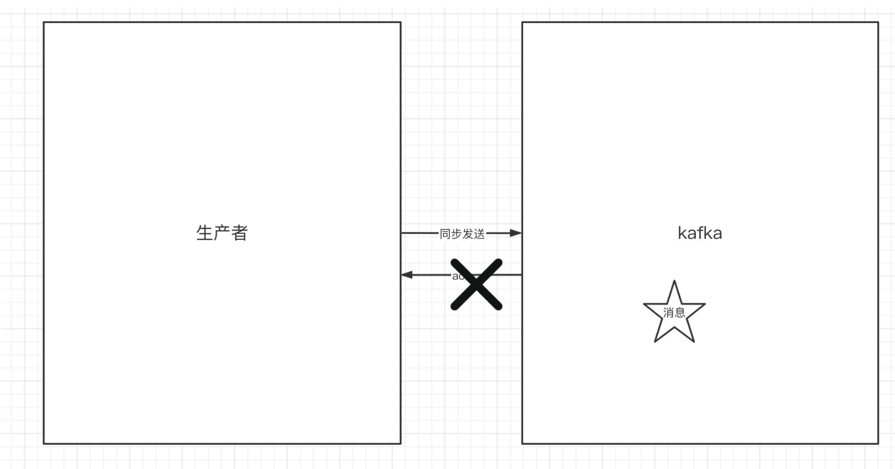
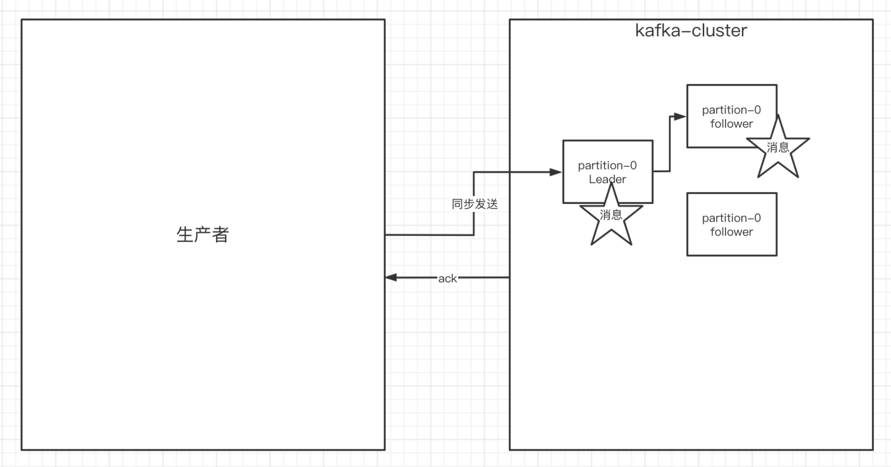

## ⼀、为什么使⽤消息队列

### 1.使⽤同步的通信⽅式来解决多个服务之间的通信


### 2.使⽤异步的通信⽅式


消息队列解决具体的是什么问题——通信问题。


## 二、Kafka的基本知识

### 1. kafka中的⼀些基本概念


### 2.创建 topic

```shell
./kafka-topics.sh --create --zookeeper 172.16.253.35:2181 --replicationfactor 1 --partitions 1 --topic test
```

### 3.发送消息

```shell
./kafka-console-consumer.sh --bootstrap-server 172.16.253.38:9092 --topic test
```

### 4.消费消息

```shell
./kafka-console-consumer.sh --bootstrap-server 172.16.253.38:9092 --topic test
```

### 5. 关于消息的细节


### 6. 单播消息

同⼀个消费组中只能有⼀个消费者收到⼀个topic中的消息

### 7. 多播消息

不同的消费组订阅同⼀个topic，那么不同的消费组中只有⼀个消费者能收到消息。


### 8. 查看消费组的详细信息

```shell
./kafka-consumer-groups.sh --bootstrap-server 172.16.253.38:9092 --describe --group testGroup
```


## 三、Kafka中主题和分区的概念

### 1. 主题Topic

主题-topic在kafka中是⼀个逻辑的概念，kafka通过topic将消息进⾏分类。不同的topic会被 订阅该topic的消费者消费。 但是有⼀个问题，如果说这个topic中的消息⾮常⾮常多，多到需要⼏T来存，因为消息是会被 保存到log⽇志⽂件中的。为了解决这个⽂件过⼤的问题，kafka提出了Partition分区的概念

### 2.分区Partition

#### 1）分区概念

Kafka 中 Topic 被分成多个 Partition 分区。Topic 是一个**逻辑概念**，Partition 是最小的**存储单元**，掌握着一个 Topic 的部分数据。每个 Partition 都是一个单独的 log 文件，每条记录都以追加的形式写入。

通过partition将⼀个topic中的消息分区来存储。这样的好处有多个：

* 1、如果一个主题只对应一个文件，那么这个文件所在的机器I/O将会成为这个主题的性能瓶颈
* 2、Kafka 为分区引入了多副本（Replica）机制，通过增加副本数量可以提升容灾能力。
* 3、提供了读写的吞吐量：读和写可以同时在多个分区中进⾏


#### 2）创建多分区的主题

```shell
./kafka-topics.sh --create --zookeeper 172.16.253.35:2181 --replicationfactor 1 --partitions 2 --topic test1
```


### 3 .kafka中消息⽇志⽂件中保存的内容

* 00000.log： 这个⽂件中保存的就是消息
* __consumer_offsets-49: 

​	kafka内部创建了 **⾃⼰__consumer_offsets主题 **包含了 **50** 个分区。这个主题⽤来存放消费 者消费某个主题的偏移量。因为每个消费者都会⾃⼰维护着消费的主题的偏移量，也就是 说每个消费者会把消费的主题的偏移量⾃主上报给kafka中的默认主题，提升这个主题的并发性，

1）提交到哪个分区：通过hash函数：hash(consumerGroupId) % __consumer_offsets 主题的分区数

2）提交到该主题中的内容是：key是consumerGroupId+topic+分区号，value就是当前 offset的值

* ⽂件中保存的消息，默认保存7天。七天到后消息会被删除。


## 五、Kafka集群操作

### 1.副本的概念

``` shell
./kafka-topics.sh --create --zookeeper 172.16.253.35:2181 --replicationfactor 3 --partitions 2 --topic my-replicated-topic
```

副本是为了为主题中的分区创建多个备份，多个副本在kafka集群的多个broker中，会有⼀个 副本作为leader，其他是follower。

查看topic情况：


* **leader**：

  kafka的写和读的操作，都发⽣在leader上。leader负责把数据同步给follower。当leader挂 了，经过主从选举，从多个follower中选举产⽣⼀个新的leader

* **follower**: 

  接收leader的同步的数据

* **Isr**：

  可以同步和已同步的节点会被存⼊到isr集合中。这⾥有⼀个细节：如果isr中的节点性能 较差，会被提出isr集合。

### 2. 分区分消费组的集群消费中的细节


## 六.⽣产者的实现

### 1.⽣产者的同步发送消息



如果⽣产者发送消息没有收到ack，⽣产者会阻塞，阻塞到3s的时间，如果还没有收到消息， 会进⾏重试。重试的次数3次。

### 2.⽣产者的异步发送消息


异步发送，⽣产者发送完消息后就可以执⾏之后的业务，broker在收到消息后异步调⽤⽣产 者提供的callback回调⽅法。


### 3.⽣产者中的ack的配置

* ack = 0 kafka-cluster不需要任何的broker收到消息，就⽴即返回ack给⽣产者，最容易 丢消息的，效率是最⾼的

* ack=1（默认）： 多副本之间的leader已经收到消息，并把消息写⼊到本地的log中，才 会返回ack给⽣产者，性能和安全性是最均衡的

* ack=-1/all。⾥⾯有默认的配置min.insync.replicas=2(默认为1，推荐配置⼤于等于2)， 此时就需要leader和⼀个follower同步完后，才会返回ack给⽣产者（此时集群中有2个 broker已完成数据的接收），这种⽅式最安全，但性能最差。



### 4.关于消息发送的缓冲区


* kafka默认会创建⼀个消息缓冲区，⽤来存放要发送的消息，缓冲区是32m
* kafka本地线程会去缓冲区中⼀次拉16k的数据，发送到broker
* 如果线程拉不到16k的数据，间隔10ms也会将已拉到的数据发到broker


## 七、消费者的实现细节

### 1、关于消费者⾃动提交和⼿动提交offset

#### 1）提交的内容 

消费者⽆论是⾃动提交还是⼿动提交，都需要把所属的消费组+消费的某个主题+消费的某个 分区及消费的偏移量，这样的信息提交到集群的_consumer_offsets主题⾥⾯。

#### 2）⾃动提交


#### 3）⼿动提交

⼿动提交⼜分成了两种： 

* ⼿动同步提交 offset

  在消费完消息后调⽤同步提交的⽅法，当集群返回ack前⼀直阻塞，返回ack后表示提交 成功，执⾏之后的逻辑

* ⼿动异步提交 offset

  在消息消费完后提交，不需要等到集群ack，直接执⾏之后的逻辑，可以设置⼀个回调⽅ 法，供集群调⽤


### 2. ⻓轮询poll消息
默认情况下，消费者⼀次会 poll 500条消息。


* 1）如果⼀次poll到500条，就直接执⾏for循环 

  2）如果这⼀次没有poll到500条。且时间在1秒内，那么⻓轮询继续poll，要么到500 条，要么到1s 

  3）如果多次poll都没达到500条，且1秒时间到了，那么直接执⾏for循环 

* 如果两次poll的间隔超过30s，集群会认为该消费者的消费能⼒过弱，该消费者被踢出消 费组，触发rebalance机制，rebalance机制会造成性能开销。可以通过设置这个参数， 让⼀次poll的消息条数少⼀点


### 3.消费者的健康状态检查


### 4.指定分区和偏移量、时间消费


#### 5.新消费组的消费offset规则

新消费组中的消费者在启动以后，默认会从当前分区的最后⼀条消息的offset+1开始消费（消 费新消息）。可以通过以下的设置，让新的消费者第⼀次从头开始消费。之后开始消费新消 息（最后消费的位置的偏移量+1）

* Latest:默认的，消费新消息
* earlier：第⼀次从头开始消费。之后开始消费新消息（最后消费的位置的偏移量+1）


## 七、kafka集群中的controller、 rebalance、HW

### 1. controller

集群中谁来充当controller 每个broker启动时会向zk创建⼀个临时序号节点，获得的序号最⼩的那个broker将会作为集 群中的controller，负责这么⼏件事：

1）当集群中有⼀个副本的leader挂掉，需要在集群中选举出⼀个新的leader，选举的规则是 从isr集合中最左边获得。

2）当集群中有broker新增或减少，controller会同步信息给其他broker

3）当集群中有分区新增或减少，controller会同步信息给其他broker

### 2. rebalance机制

前提：消费组中的消费者没有指明分区来消费

触发的条件：当消费组中的消费者和分区的关系发⽣变化的时候

分区分配的策略：在rebalance之前，分区怎么分配会有这么三种策略

1）range：根据公示计算得到每个消费消费哪⼏个分区：前⾯的消费者是分区总数/消费 者数量+1,之后的消费者是分区总数/消费者数量 
2）轮询：⼤家轮着来 
3）sticky：粘合策略，如果需要rebalance，会在之前已分配的基础上调整，不会改变之 前的分配情况。如果这个策略没有开，那么就要进⾏全部的重新分配。建议开启。

### 3. HW和LEO


## ⼗、Kafka中的优化问题

### 1. 如何防⽌消息丢失

⽣产者：1）使⽤同步发送 2）把ack设成1或者all，并且设置同步的分区数>=2 

消费者：把⾃动提交改成⼿动提交

### 2. 如何防⽌重复消费

在防⽌消息丢失的⽅案中，如果⽣产者发送完消息后，因为⽹络抖动，没有收到ack，但实际 上broker已经收到了。
此时⽣产者会进⾏重试，于是broker就会收到多条相同的消息，⽽造成消费者的重复消费。 

解决方案：

方案一：⽣产者关闭重试：会造成丢消息（不建议）

方案二：消费者解决⾮幂等性消费问题，所谓的幂等性：多次访问的结果是⼀样的。对于rest的请求（get（幂等）、post（⾮幂 等）、put（幂等）、delete（幂等））
 解决⽅案：

 * **在数据库中创建联合主键，防⽌相同的主键 创建出多条记录**
* **使⽤分布式锁，以业务id为锁。保证只有⼀条记录能够创建成功**
* **为更新的数据设置前置条件（版本号）** 


### 3. 如何做到消息的顺序消费 

* ⽣产者：保证消息按顺序消费，且消息不丢失——使⽤同步的发送，ack设置成⾮0的 值。

* 消费者：主题只能设置⼀个分区，消费组中只能有⼀个消费者 kafka的顺序消费使⽤场景不多，因为牺牲掉了性能，但是⽐如rocketmq在这⼀块有专⻔的 功能已设计好。


### 4. 如何解决消息积压问题


#### 1）消息积压问题的出现

 消息的消费者的消费速度远赶不上⽣产者的⽣产消息的速度，导致kafka中有⼤量的数据没有 被消费。随着没有被消费的数据堆积越多，消费者寻址的性能会越来越差，最后导致整个 kafka对外提供的服务的性能很差，从⽽造成其他服务也访问速度变慢，造成服务雪崩。 

#### 2）消息积压的解决⽅案 

* 在这个消费者中，使⽤多线程，充分利⽤机器的性能进⾏消费消息。
* 通过业务的架构设计，提升业务层⾯消费的性能。
* 创建多个消费组，多个消费者，部署到其他机器上，⼀起消费，提⾼消费者的消费速度
* 创建⼀个消费者，该消费者在kafka另建⼀个主题，配上多个分区，多个分区再配上多个 消费者。该消费者将poll下来的消息，不进⾏消费，直接转发到新建的主题上。此时，新 的主题的多个分区的多个消费者就开始⼀起消费了。——不常⽤


拓展：MQTT（Message  QueueIng Telemetry Transport，消息队列遥测传输协议）是一种基于发布/订阅（publish/subscribe）模式的"轻量级"通讯协议，该协议构建于TCP/IP协议上，由IBM在1999年发布。


## 主要特性

有三种消息发布服务质量：

- **At most once**: 至多一次。消息在传递时，最多会被送达一次。换一个说法就是，没什么消息可靠性保证，允许丢消息。一般都是一些对消息可靠性要求不太高的监控场景使用，比如每分钟上报一次机房温度数据，可以接受数据少量丢失。
- **At least once**: 至少一次。消息在传递时，至少会被送达一次。也就是说，不允许丢消息，但是允许有少量重复消息出现。
- **Exactly once**：恰好一次。消息在传递时，只会被送达一次，不允许丢失也不允许重复，这个是最高的等级。

参考：

https://zhuanlan.zhihu.com/p/68052232


