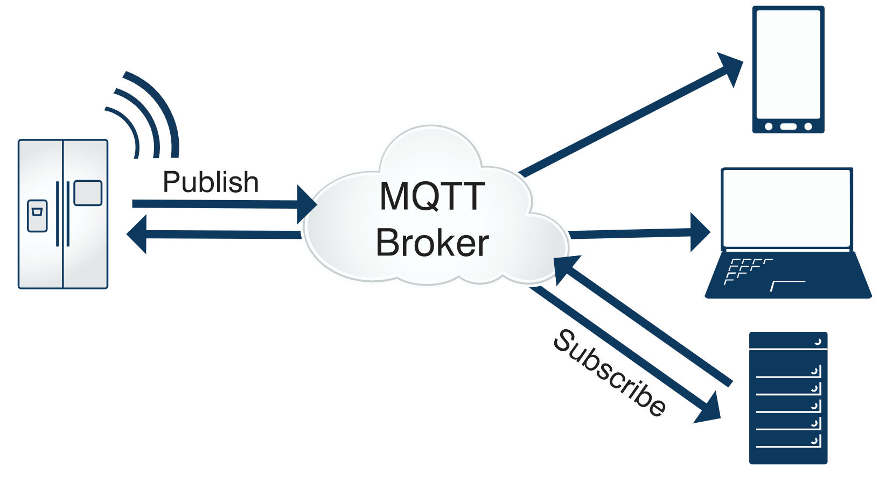

MQTT（Message  QueueIng Telemetry Transport，消息队列遥测传输协议）是一种基于发布/订阅（publish/subscribe）模式的"轻量级"通讯协议，该协议构建于TCP/IP协议上，由IBM在1999年发布。

## 主要特性

有三种消息发布服务质量：

- **At most once**: 至多一次。消息在传递时，最多会被送达一次。换一个说法就是，没什么消息可靠性保证，允许丢消息。一般都是一些对消息可靠性要求不太高的监控场景使用，比如每分钟上报一次机房温度数据，可以接受数据少量丢失。
- **At least once**: 至少一次。消息在传递时，至少会被送达一次。也就是说，不允许丢消息，但是允许有少量重复消息出现。
- **Exactly once**：恰好一次。消息在传递时，只会被送达一次，不允许丢失也不允许重复，这个是最高的等级。

从对系统的影响结果来说：**At least once + 幂等消费 = Exactly once。**

## 用幂等性解决重复消息问题

**1. 利用数据库的唯一约束实现幂等（联合主键、唯一索引）**

**2. 为更新的数据设置前置条件 (版本号)**

**3.使⽤分布式锁，以业务id为锁。保证只有⼀条记录能够创建成功**