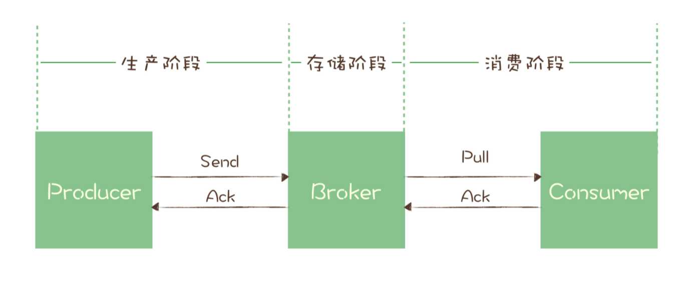

## 确保消息可靠传递

你可以看下这个图，一条消息从生产到消费完成这个过程，可以划分三个阶段，为了方便描述，我给每个阶段分别起了个名字。



- **生产阶段**: 在这个阶段，从消息在 Producer 创建出来，经过网络传输发送到 Broker 端。
- **存储阶段**: 在这个阶段，消息在 Broker 端存储，如果是集群，消息会在这个阶段被复制到其他的副本上。
- **消费阶段**: 在这个阶段，Consumer 从 Broker 上拉取消息，经过网络传输发送到 Consumer 上。

**1. 生产阶段**

在生产阶段，消息队列通过最常用的请求确认机制，来保证消息的可靠传递：当你的代码调用发消息方法时，消息队列的客户端会把消息发送到 Broker，Broker 收到消息后，会给客户端返回一个确认响应，表明消息已经收到了。客户端收到响应后，完成了一次正常消息的发送。

只要 Producer 收到了 Broker 的确认响应，就可以保证消息在生产阶段不会丢失。有些消息队列在长时间没收到发送确认响应后，会自动重试，如果重试再失败，就会以返回值或者异常的方式告知用户。

**你在编写发送消息代码时，需要注意，正确处理返回值或者捕获异常，就可以保证这个阶段的消息不会丢失。**以 Kafka 为例，我们看一下如何可靠地发送消息：

同步发送时，只要注意捕获异常即可。

```java
try {
    RecordMetadata metadata = producer.send(record).get();
    System.out.println(" 消息发送成功。");
} catch (Throwable e) {
    System.out.println(" 消息发送失败！");
    System.out.println(e);
}
```

异步发送时，则需要在回调方法里进行检查。这个地方是需要特别注意的，很多丢消息的原因就是，我们使用了异步发送，却没有在回调中检查发送结果。

```java
producer.send(record, (metadata, exception) -> {
    if (metadata != null) {
        System.out.println(" 消息发送成功。");
    } else {
        System.out.println(" 消息发送失败！");
        System.out.println(exception);
    }
});
```


**2. 存储阶段**

对于单个节点的 Broker，需要配置 Broker 参数，在收到消息后，将消息写入磁盘后再给 Producer 返回确认响应，这样即使发生宕机，由于消息已经被写入磁盘，就不会丢失消息，恢复后还可以继续消费。

如果是 Broker 是由多个节点组成的集群，需要将 Broker 集群配置成：至少将消息发送到 2 个以上的节点，再给客户端回复发送确认响应。副本replica


**3. 消费阶段**

消费阶段采用和生产阶段类似的确认机制来保证消息的可靠传递，客户端从 Broker 拉取消息后，执行用户的消费业务逻辑，成功后，才会给 Broker 发送消费确认响应